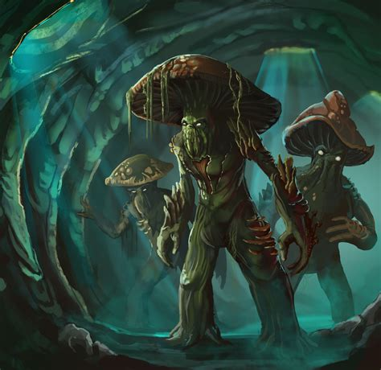

# Architecture

A project about the savage mushroom-people who live in the caverns below the city.



## Installation

```bash
PORT=XXXX
DB_URL=XXXXXXXXXXXX
```

`npm run install -D`

`npm run setup`

## Environment

This app requires a `.env` file to run locally. It needs the following information


## Development server

`npm run dev`

## Deployment server

`npm run start`

## API

| Route | Method | Function |
| --- | --- | --- |
| `/` | `GET` | Welcome message | 
| `/mushrooms` | `GET` | List all mushrooms | 
| `/mushrooms` | `POST` | Create a mushroom | 
| `/mushrooms/:id` | `GET` | View a specific mushroom | 
| `/mushrooms/:id` | `DELETE` | Delete a mushroom | 
| `/mushrooms/:id` | `PATCH` | Update a mushroom | 

| `/mushrooms/:id/friends`| `GET` | List all friends of a specific mushroom *Not implemented*|
| `/friends`| `GET` | List all friendships |
| `/friends`| `POST` | Create a new friendship |
| `/friends/:id`| `GET` | View a specific friendship |
| `/friends/:id`| `DELETE` | Delete a friendship |
